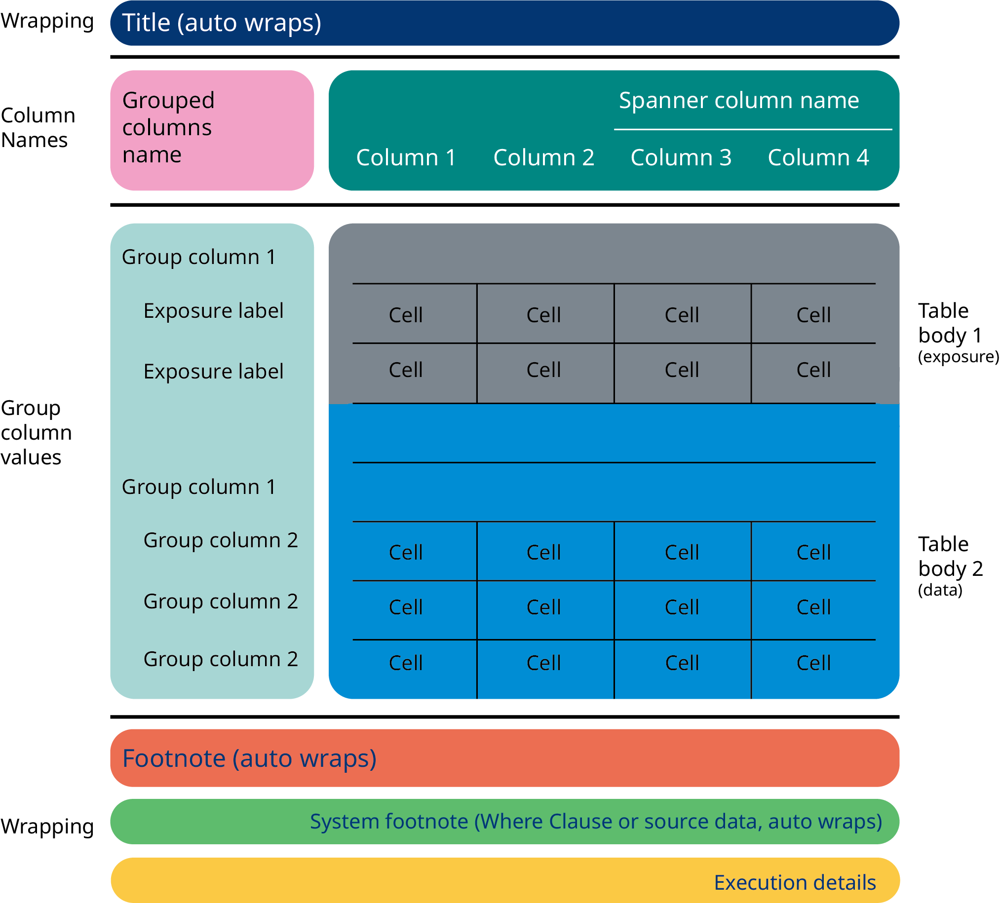

<p>

<span style="font-size:100px"><sup><font color="DarkBlue">NN</font>table</sup></span>
</p>

<!-- badges: start -->
[](https://novonordiskit.visualstudio.com/BOS/_build/latest?definitionId=1152&branchName=master)
[](https://novonordiskit.visualstudio.com/SCE-R/_release?_a=releases&view=mine&definitionId=29)
[](https://novonordiskit.visualstudio.com/3d1f3d66-ac3d-4106-a6cd-7035e84f3854/_boards/board/t/da722b93-da4d-4626-9151-4b5bd40235fa/Microsoft.RequirementCategory/)
<!-- badges: end -->

The **R**-package **NNtable** supplies users with functions for creating tables that can be used in NN TFL. 

Current webpage: [NNtable](http://10.59.86.7/NNpackages/NNtable/)

----
## Design Philosophy
The philosophy behind NNtable is to separate the derivation of statistics and the layout of an output table. All layout specific derivations are supposed to be handled by the NNTable functionality. The philosophy is further explained in the figure below


----
## NNTable Layout Functionality

The functionality of `NNtable` is similar to that of ggplot2 in the sense that an 
NNTable object is a list of instructions that is carried out once you print the object. 
An NNTable object is initilised by the function `NNTable()` and it is possible to 
add elements to the table by using the `add...` functions. 

An NNTable consists of several elements that are outlined by the different coloured areas in the figure below



It is only possible to add the same type of element once, otherwise the previous addition is overwritten. 
The transformations of the layout changes introduced by the `add...` functions are performed in the following order:

1. **Exposure data:** The exposure data is added to the original data in accordance with `addExposure()`

2. **Filling:** The combinatorial blanks created by transposing data are occupired as determined by `addFilling()`

3. **Formating:** The columns are formatted in accordance to the specification given in `addFormat()`

4. **Rename:** The rename determined in the `NNTable()` call is performed

5. **Concatenation:** The concatenation and formating of columns determined in the `NNTable()` call is performed, e.g. brackets around numbers or concatenating `Mean (SD)`

6. **Transpose longer:** The columns defined by `addTransLong()` are created

7. **Transpose wider:** The colums defined by  `addTransWide()` are created. 

8. **Cell split:** The cells are split into new rows in accordance with the predetermined cell splits as determined by `addCellSplit()`. 

9. **Truncation:** Them cells are split into new rows in accordance with the individual maximum width determined by `addTruncation()`

10. **Stub:** The stub is created as defined by `addGroupedColumns()`

11. **Ordering** The data is ordered as defined by `addOrder()`

The execution order is always carried out in the order outlined above. Consequently, 
the order the `add...` functions are used is disregarded. This enables the possibility to slowly advance in the creation of the layout and print the table in the progress to see what is needed.

It should also be noted that renaming of columns within the `NNTable()` call 
will have the consequence that the new name should be used in subsequent `add...` 
functionality. It should likewise be noted that new columns created in a call to 
`addTransLong()` can be used in `addTransWide()` by referring to the given name. 
This functionality is used to create summary tables and an example can be found 
at `addTransLong()`.

----

### Column rename and collapse

Since we do not want to do any layout specific changes before the `NNTable()` call, 
the function has a build in method for renaming columns as well as collapsing columns as needed. 

This type of layout is specified directly within the call to `NNTable()`. Say we have columns 
`mean`, `sd`, `min` and `max`, then we can rename by 
`NNTable(Mean = "mean", SD = "sd", Min = "min", Max = Max)`. In this case the 
column names becomes Mean, SD, Min, and Max.

We also have the possibility to collapse by 
`NNTable("Mean (SD)" = "mean (SD)", "Min ; Max" = "min ; max")` in this case we 
will have the column names Mean (SD) and Min ; Max, and the values will be shown 
as formatted on the left of the equal sign. 

The rename and collapse is exemplified further in the figure below. 
Here the columns `C` and `D` represent Mean and SD and are collapsed into a 
single column called `Mean (SD)`. The column `E` represents `AGE` and is renamed 
accordingly.  


----
### Transpose to long 

In some instances it is necessary to transpose columns to long. 
For example, say we need a summary table with, N, Mean, SD, Min and Max. 
We would calculate the summaries using `dplyr::summarise()` resulting in a 
different column for each summary, which we would like to appear underneath 
each other in the final output with a column indicating what summary we see. 
This can be done using:

```r
NNTable("N", "Mean (SD)" = "mean (SD)", "Min ; Max" = "min ; max") %>% 
  addTransLong(sum = c("N", "Mean (SD)", "Min ; Max"), var_name = "name")`
```

Note how the renamed/concatenated column names are used in the flow. 
It is possible to combine `addTransLong()` with `addTransWide()` and/or `addGroupedColumns()`, 
then you just need to use the variable names defined in `addTransLong()`,
i.e. `sum` and `name` in the example.

The principle is further exemplified in the figure below where the columns 
`C`, `D`, and `E` is transposed to long. The new columns `F` and `G` represent 
the values and column names, respectively, as indicated by the colouring. 
These new columns can be used within `addTransWide()` and/or `addGroupedColumns()` 
as any other column.


----
### Nested columns (column-wise)

Within the NNtable functionality two types of nested columns are defined: 
A header above existing columns or columns that are transposed from long to wide.


A header above two existing columns in an output is defined in the initiation of NNTable, e.g. 
`NNTable(data, "Headline defining the columns" = c(column1, column2))` 
Will write the text  *Headline defining the columns* above the `column1` and `column2`. 
This is exemplified in the figure below where columns `C` and `D` are nested under the pink text. 


In case the columns are nested within the values of another column, the function 
`addTransWide()` is used, e.g. `addTransWide(SEX = list(TRTP = c(column1, column2)))`,
will nest `column1` and `column2` under the values of `TRTP` which in turn are 
nested under the values of `SEX`. This is exemplified below where columns `C`, `D`, 
and `E` are nested under the values of column `B`, which in turn are nested under column `A`


----
### Nested columns (row-wise), the Stub

The Stub of an `NNTable()` is defined by the function `addGroupedColumns()`. 
For example `addGroupedColumns("PARAM", "AVISIT", "SUMMARY", name = "The column name")` 
will nest the values of column `SUMMARY` under the values of column `AVISIT`, 
which in turn is nested under the values of column `PARAM`. The name of the column is `The column name`.

This is exemplified below where columns `A`, `B`, and `C` are grouped together 
in the stub under a column name indicated by the pink strip. 
In the example the first value of column `C` is empty. For a grouped column 
that means the row is associated with the next stub level (column `B`). 
There are no empty values in column `B` so no rows are left over to column `A`. 
Consequently, the values of column `A` are treated as spanning rows that are 
put on top of the nested rows.  


----
## Installation 
The package can be installed directly from RStudios package management system


### **R**-server

On the R-server an updated set of packages can be installed by the following command:
```r
install.packages("NNtable") 
```

### Local laptop

On your local laptop an updated set of packages can be installed by the following command:
```r
install.packages("NNtable", repos = "https://rspm.bifrost-prd.corp.aws.novonordisk.com/cran-internal-prod/latest") 
```

Remember that R-tools need to be installed and paths need to be included in windows paths variable.

----
## Contribute

We welcome all to contribute to the **NNtable** project. If you want to contribute,
note that we try to adhere to the [GitHub flow](https://guides.github.com/introduction/flow/) model. I.e. the master
branch is always deployable. Hence, we request that you use git branches and merge requests.

The following lists the requirements
* The master branch is always deployable (i.e. as a minimum passing R CMD checks and unit tests)
* Use git feature/bugfix branches and merge requests to the master
* [Semantic versioning](https://semver.org/)
* Follow the used coding style and use Rstudio's code styling diagnostics.
* Remember to do an R CMD check before committing.
* Always consider writing some [unit tests](http://r-pkgs.had.co.nz/tests.html) for your new functionality. 
* Unlike SAS - R code should fail or warn loudly and proudly if input is ambiguous or unexpected.
